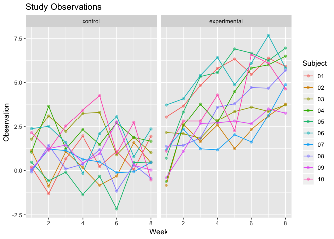

p8105\_hw5\_dk2759
================
Darwin Keung
11/7/2018

# Problem 1

This zip file contains data from a longitudinal study that included a
control arm and an experimental arm. Data for each participant is
included in a separate file, and file names include the subject ID and
arm.

### Goal: Create a tidy dataframe containing data from all participants, including the subject ID, arm, and observations over time.

Extracting the filepaths and names

``` r
filepath = list.files("./data", pattern = "*.csv", full.names = TRUE)
filename = basename(filepath)
# pattern selects for only .csv file types
# basename removes all of the path up to and including the last path separator (if any).
```

Function to read the data

``` r
read = function(data, name){
  list(read_csv(file = data) %>% mutate(id = name))
}
```

Now iterating with `map` to read all the csv files and bind them
together

Tidy Data from wide to long form, separate the study arms and IDs

``` r
tidy_df = df %>%
  gather(key = week, value = score, week_1:week_8) %>% 
  mutate(id = str_replace(id, ".csv",""), 
         week = as.numeric(str_replace(week, "week_", ""))) %>% 
  separate(id, into = c("arm", "id"), sep = "_") %>% 
  mutate(id = as.factor(id)) %>% 
  mutate(arm = str_replace(arm, "con", "control")) %>% 
  mutate(arm = str_replace(arm, "exp", "experimental"))

skimr::skim(tidy_df)
```

    ## Skim summary statistics
    ##  n obs: 160 
    ##  n variables: 4 
    ## 
    ## ── Variable type:character ────────────────────────────────────────────────────────────────────
    ##  variable missing complete   n min max empty n_unique
    ##       arm       0      160 160   7  12     0        2
    ## 
    ## ── Variable type:factor ───────────────────────────────────────────────────────────────────────
    ##  variable missing complete   n n_unique                     top_counts
    ##        id       0      160 160       10 01: 16, 02: 16, 03: 16, 04: 16
    ##  ordered
    ##    FALSE
    ## 
    ## ── Variable type:numeric ──────────────────────────────────────────────────────────────────────
    ##  variable missing complete   n mean   sd    p0  p25  p50  p75 p100
    ##     score       0      160 160 2.33 2.11 -2.17 0.76 2.08 3.6  7.66
    ##      week       0      160 160 4.5  2.3   1    2.75 4.5  6.25 8   
    ##      hist
    ##  ▁▅▇▇▆▂▃▁
    ##  ▇▇▇▇▇▇▇▇

These longitudinal study data contains 160 observations and 4 variables
(`arm` : character. `id` : factor. `score` and `week` : numeric). `arm`
is either experimental or control. The study duration lasts 8 weeks,
there are 10 subjects in each arm.

### Visualization

Make a spaghetti plot showing observations on each subject over time,
and comment on differences between groups.

``` r
ggplot(tidy_df, aes(x = week, y = score, color = id, group = id )) + 
  geom_point(alpha = 0.5) + 
  geom_line() + 
  facet_grid(~arm) +
labs(
    title = "Study Observations", 
    x = "Week", 
    y = "Observation", 
    color = "Subject")
```

<!-- -->

In the experimental group the scores trend upwards over time while the
control groups stay roughly constant. Don’t have enough information to
say what the numbers represent.

# Problem 2

The Washington Post has gathered data on homicides in 50 large U.S.
cities and made the data available through a GitHub repository here. You
can read their accompanying article here.

Describe the raw data. Create a city\_state variable (e.g. “Baltimore,
MD”) and then summarize within cities to obtain the total number of
homicides and the number of unsolved homicides (those for which the
disposition is “Closed without arrest” or “Open/No arrest”).

For the city of Baltimore, MD, use the prop.test function to estimate
the proportion of homicides that are unsolved; save the output of
prop.test as an R object, apply the broom::tidy to this object and pull
the estimated proportion and confidence intervals from the resulting
tidy dataframe.

Now run prop.test for each of the cities in your dataset, and extract
both the proportion of unsolved homicides and the confidence interval
for each. Do this within a “tidy” pipeline, making use of purrr::map,
purrr::map2, list columns and unnest as necessary to create a tidy
dataframe with estimated proportions and CIs for each city.

Create a plot that shows the estimates and CIs for each city – check out
geom\_errorbar for a way to add error bars based on the upper and lower
limits. Organize cities according to the proportion of unsolved
homicides

\============== Notes to self tried this, some sort of directory error
to get my function to work.

\#\`\`\`{r build\_dataframe} \# list the files df =
tibble(list.files(path = “./data”)) is.list(df)

# make a function for reading out each csv in my list

list\_df \<- function(file\_name) { read\_csv(paste0(“data”, df)) }

# map

mutate(map(.x = df, .f = list\_df)) \`\`\`.
