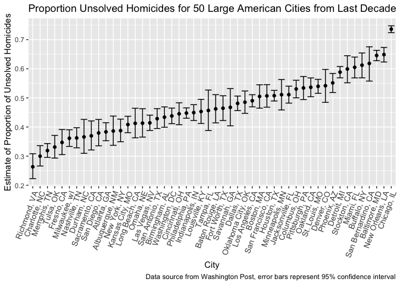

p8105\_hw5\_dk2759
================
Darwin Keung
11/7/2018

# Problem 1

This [zip file](http://p8105.com/data/hw5_data.zip) contains data from a
longitudinal study that included a control arm and an experimental arm.
Data for each participant is included in a separate file, and file names
include the subject ID and
arm.

##### Goal: Create a tidy dataframe containing data from all participants, including the subject ID, arm, and observations over time.

Extract the file paths and
names

``` r
filepath = list.files("./data/problem_1", pattern = "*.csv", full.names = TRUE)
filename = basename(filepath)
# pattern selects for only .csv file types
# basename removes all of the path up to and including the last path separator (if any).
```

Function to read the data

``` r
read = function(data, name){
  
  list(read_csv(file = data) %>% mutate(id = name))
  
}
```

Iterate with `map` to read all the csv files and bind them together

``` r
path_name = purrr::map2(filepath, filename, read)
df = purrr::map_df(path_name, bind_rows)
```

Tidy Data from wide to long form, separate the study arms and IDs

``` r
tidy_df = df %>%
  gather(key = week, value = score, week_1:week_8) %>% 
  mutate(id = str_replace(id, ".csv",""), 
         week = as.numeric(str_replace(week, "week_", ""))) %>% 
  separate(id, into = c("arm", "id"), sep = "_") %>% 
  mutate(id = as.factor(id)) %>% 
  mutate(arm = str_replace(arm, "con", "control")) %>% 
  mutate(arm = str_replace(arm, "exp", "experimental"))
skimr::skim(tidy_df)
```

    ## Skim summary statistics
    ##  n obs: 160 
    ##  n variables: 4 
    ## 
    ## ── Variable type:character ────────────────────────────────────────────────────────────────────
    ##  variable missing complete   n min max empty n_unique
    ##       arm       0      160 160   7  12     0        2
    ## 
    ## ── Variable type:factor ───────────────────────────────────────────────────────────────────────
    ##  variable missing complete   n n_unique                     top_counts
    ##        id       0      160 160       10 01: 16, 02: 16, 03: 16, 04: 16
    ##  ordered
    ##    FALSE
    ## 
    ## ── Variable type:numeric ──────────────────────────────────────────────────────────────────────
    ##  variable missing complete   n mean   sd    p0  p25  p50  p75 p100
    ##     score       0      160 160 2.33 2.11 -2.17 0.76 2.08 3.6  7.66
    ##      week       0      160 160 4.5  2.3   1    2.75 4.5  6.25 8   
    ##      hist
    ##  ▁▅▇▇▆▂▃▁
    ##  ▇▇▇▇▇▇▇▇

These longitudinal study data contains 160 observations and 4 variables
(`arm` : character. `id` : factor. `score` and `week` : numeric). `arm`
is either experimental or control. The study duration lasts 8 weeks,
there are 10 subjects in each arm.

### Visualization

Make a spaghetti plot showing observations on each subject over time,
and comment on differences between groups.

``` r
ggplot(tidy_df, aes(x = week, y = score, color = id, group = id )) + 
  geom_point(alpha = 0.5) + 
  geom_line() + 
  facet_grid(~arm) +
labs(
    title = "Study Observations", 
    x = "Week", 
    y = "Observation", 
    color = "Subject")
```

<!-- -->

In the experimental group the scores trend upwards over time while the
control groups stay roughly constant. Don’t have enough information to
say what the numbers represent.

# Problem 2

The *Washington Post* has gathered data on homicides in 50 large U.S.
cities and made the data available through a GitHub repository
[here](https://github.com/washingtonpost/data-homicides). You can read
their accompanying article
[here](https://www.washingtonpost.com/graphics/2018/investigations/where-murders-go-unsolved/).

#### Data import

``` r
homicide_df = read_csv("./data/problem_2/wapo_homicide_data.csv", col_names = TRUE)
```

    ## Parsed with column specification:
    ## cols(
    ##   uid = col_character(),
    ##   reported_date = col_integer(),
    ##   victim_last = col_character(),
    ##   victim_first = col_character(),
    ##   victim_race = col_character(),
    ##   victim_age = col_character(),
    ##   victim_sex = col_character(),
    ##   city = col_character(),
    ##   state = col_character(),
    ##   lat = col_double(),
    ##   lon = col_double(),
    ##   disposition = col_character()
    ## )

Describe the raw data:

These data have 52179 rows and 12 columns. The variables include a
unique id, report date, first and last names of victims, age, sex, race,
location (city, state, lat, long), and disposition.

#### Data manipulation

Create a city\_state variable (e.g. “Baltimore,
MD”)

``` r
homicide_df = homicide_df = read_csv("./data/problem_2/wapo_homicide_data.csv", col_names = TRUE) %>% 
  mutate(city_state = paste(city, state, sep = ", "))
```

    ## Parsed with column specification:
    ## cols(
    ##   uid = col_character(),
    ##   reported_date = col_integer(),
    ##   victim_last = col_character(),
    ##   victim_first = col_character(),
    ##   victim_race = col_character(),
    ##   victim_age = col_character(),
    ##   victim_sex = col_character(),
    ##   city = col_character(),
    ##   state = col_character(),
    ##   lat = col_double(),
    ##   lon = col_double(),
    ##   disposition = col_character()
    ## )

``` r
# sep = ", " is also the same as city, ",", " ", state)
```

Summarize within cities to obtain the total number of homicides and the
number of unsolved homicides (those for which the disposition is “Closed
without arrest” or “Open/No arrest”).

``` r
summ_homicide_df = homicide_df %>% 
  group_by(city_state) %>% 
  mutate(homicide_total = n()) %>% 
  filter(disposition == "Closed without arrest" | disposition == "Open/No arrest") %>%
  mutate(homicide_unsolved = n()) %>% 
  select(city_state, homicide_unsolved, homicide_total) %>%
  distinct(.keep_all = FALSE)

summ_homicide_df
```

    ## # A tibble: 50 x 3
    ## # Groups:   city_state [50]
    ##    city_state      homicide_unsolved homicide_total
    ##    <chr>                       <int>          <int>
    ##  1 Albuquerque, NM               146            378
    ##  2 Atlanta, GA                   373            973
    ##  3 Baltimore, MD                1825           2827
    ##  4 Baton Rouge, LA               196            424
    ##  5 Birmingham, AL                347            800
    ##  6 Boston, MA                    310            614
    ##  7 Buffalo, NY                   319            521
    ##  8 Charlotte, NC                 206            687
    ##  9 Chicago, IL                  4073           5535
    ## 10 Cincinnati, OH                309            694
    ## # ... with 40 more rows

Summary of homicides displays the data as 50 observations of data, and 3
variables: city\_state, homicide\_unsolved, homicide\_total.

#### Balitmore Homicides

*For the city of Baltimore, MD, use the prop.test function to estimate
the proportion of homicides that are unsolved; save the output of
prop.test as an R object, apply the broom::tidy to this object and pull
the estimated proportion and confidence intervals from the resulting
tidy dataframe.*

``` r
# Summary of Baltimore homicides
baltimore = summ_homicide_df %>% 
  filter(city_state == "Baltimore, MD")

# proportion testing, estimating number of unsolved
prop_unsolved_baltimore = prop.test(baltimore[[2]], baltimore[[3]]) %>% 
  broom::tidy() %>%  
  select(estimate, conf.low, conf.high) %>%
  knitr::kable(digits = 3)
```

#### Prop.test for all cities

*Now run prop.test for each of the cities in your dataset, and extract
both the proportion of unsolved homicides and the confidence interval
for each. Do this within a “tidy” pipeline, making use of purrr::map,
purrr::map2, list columns and unnest as necessary to create a tidy
dataframe with estimated proportions and CIs for each city.*

``` r
# write function for prop_test for mapping later
prop_test = function(var_numerator, var_denominator) {
  
  try(prop.test(var_numerator, var_denominator) %>% 
    broom::tidy() %>% 
    select(estimate, conf.low, conf.high), silent = FALSE)
  
}
# try is a wrapper to run an expression that might fail and allow the user's code to handle error-recovery. silent hides the errors.

prop_test_unsolved_cities = 
  summ_homicide_df %>% 
  mutate(prop_test = map2(homicide_unsolved, homicide_total, prop_test)) %>%
  unnest() %>% 
  ungroup() %>% 
  janitor::clean_names()

prop_test_unsolved_cities
```

    ## # A tibble: 50 x 6
    ##    city_state  homicide_unsolv… homicide_total estimate conf_low conf_high
    ##    <chr>                  <int>          <int>    <dbl>    <dbl>     <dbl>
    ##  1 Albuquerqu…              146            378    0.386    0.337     0.438
    ##  2 Atlanta, GA              373            973    0.383    0.353     0.415
    ##  3 Baltimore,…             1825           2827    0.646    0.628     0.663
    ##  4 Baton Roug…              196            424    0.462    0.414     0.511
    ##  5 Birmingham…              347            800    0.434    0.399     0.469
    ##  6 Boston, MA               310            614    0.505    0.465     0.545
    ##  7 Buffalo, NY              319            521    0.612    0.569     0.654
    ##  8 Charlotte,…              206            687    0.300    0.266     0.336
    ##  9 Chicago, IL             4073           5535    0.736    0.724     0.747
    ## 10 Cincinnati…              309            694    0.445    0.408     0.483
    ## # ... with 40 more rows

Comment on prop.test for all cities:

Wrote a function to run a `prop.test` mapped the estimates and
confidence intervals to each homicide data point for each city. Added 3
new variables of estimates, and low and high confidence limits in a 95%
confidence interval.

#### Plotting the estimates and CIs

**Create a plot that shows the estimates and CIs for each city – check
out geom\_errorbar for a way to add error bars based on the upper and
lower limits. Organize cities according to the proportion of unsolved
homicides**

``` r
prop_test_unsolved_cities %>% 
  mutate(city_state = fct_reorder(city_state, estimate)) %>% 
  ggplot(aes(x = city_state, y = estimate)) + 
  geom_point() + 
  geom_errorbar(aes(ymin = conf_low, ymax = conf_high)) + 
  theme(axis.text.x = element_text(angle = 70, hjust = 1, size = 10)) +
  labs(
    title = "Proportion Unsolved Homicides for 50 Large American Cities from Last Decade", 
    x = "City",
    y = "Estimate of Proportion of Unsolved Homicides",
    caption = "Data source from Washington Post, error bars represent 95% confidence interval"
  )
```

<!-- -->

Comment on plot: Richmond, VA has the lowest estimated unsolved
homicides, whereas Chicago, IL has the most, over 70% with the narrowest
confidence interval amongst the 50 cities\! New York, NY is within the
top 15 proportion of solved homicides with around 40%.
